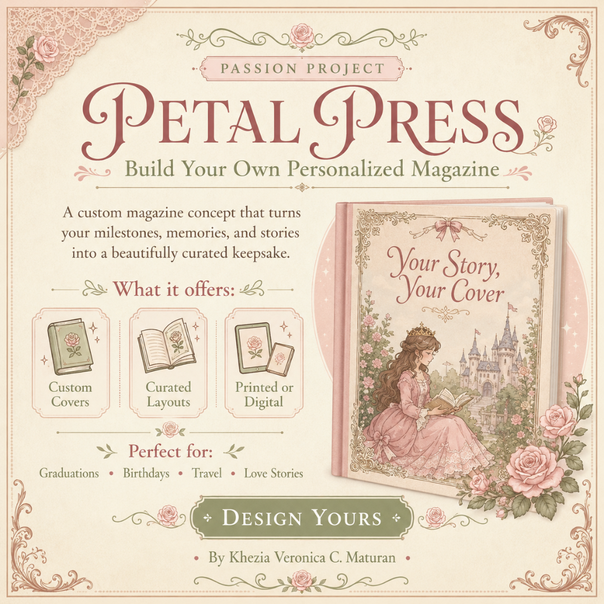
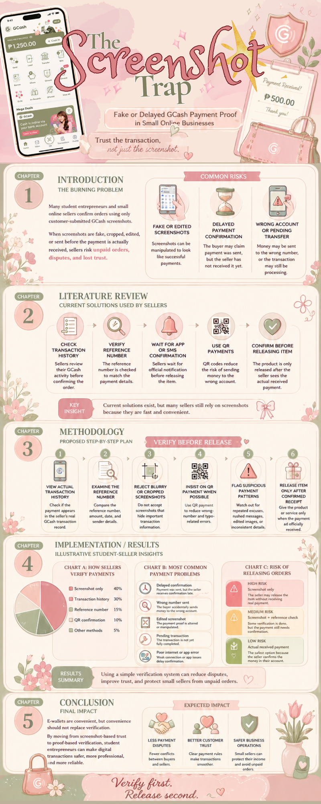
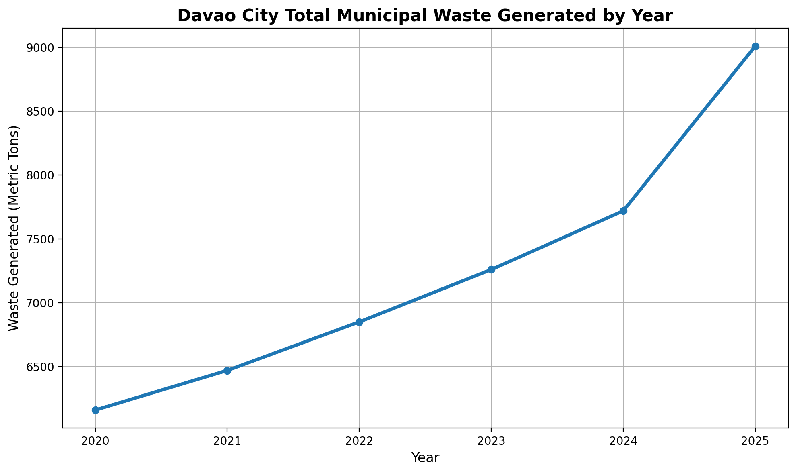
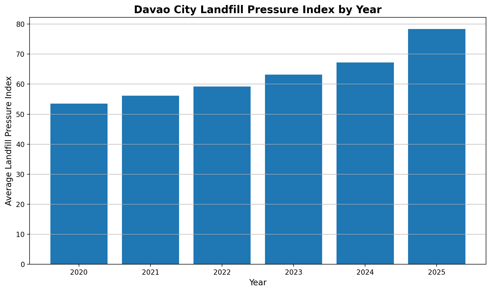

# Khezia Veronica C. Maturan | Professional Design Portfolio

## Blending creativity, strategy, and purpose to build ideas that bloom.**

## Professional Bio

Hello! I am **Khezia**, an aspiring business leader and creative entrepreneur with an interest in graphic design, organization, leadership, communication, and personal branding. This portfolio gathers my preliminary GE-IT Skills outputs into one live-hosted professional hub, showcasing how I use creativity, strategy, layout, and digital tools to present meaningful ideas in a clear and professional way.

---

## Portfolio Directory

This repository is organized into four main sections:

- `/brandingkit` - Color sheets and brand identity materials
- `/visuals` - Public material and banner 
- `/docs` - Infographics, brief reports, and written design documents
- `/media` - Videos, prototype links, and interactive media references

---

## Branding Materials

[Branding Activity PDF](brandingkit/Maturan_Activity1_compressed.pdf)

[Brand Hex Codes](brandingkit/brand-hex-codes.txt)

### Reflection

For my branding materials, I finalized the color palette and fonts that would guide the visual identity of my succeeding projects. I chose a whimsical, feminine, and earthy style inspired by vintage fantasy storybooks because I wanted my portfolio to reflect my personal preferences while still looking readable and professional. My goal was to create a brand identity that feels soft, imaginative, and personal without becoming too playful or distracting.

---

## Visual Designs

### Reflection

For the visual graphics, I used layout, color, and typography to create designs that are visually appealing and easy to understand. The profile banner and promotional graphic show my ability to present information creatively while still keeping the overall message organized and professional.

---

## Documents and Infographics

### Reflection

For my infographic output, I focused on arranging information in a clear and readable way while still following my chosen color palette and whimsical aesthetic. Although I personally enjoy maximalist designs, I made sure that each visual element still supported the topic and did not overpower the message. I wanted the final design to feel expressive and detailed, but also organized enough for viewers to understand the information easily.

---

## Media and Prototype Links

### Video or Prototype Access

- [Prototype Document](media/Maturan_Prototype.docx)
- [Video Introduction](media/Maturan_VideoIntroduction.MOV)
- [Media Folder Notes](media/README.txt)

### Reflection

For my media-based outputs, I emphasized presentation, self-expression, and audience experience. In my video introduction, I followed my main goal of whimsical storytelling by introducing myself through a story-style AVP format, using smooth Canva transitions even though it was my first time working with that approach. For the prototype, I wanted to represent myself not only through direct descriptions, but also through the different media, interests, and inspirations that I enjoy, so I designed it to be as interactive and meaningful as possible through its pages, visuals, and overall flow.

---

## AI Explorer Activities
## Prompt Engineering (Text & Image Generation)

### The Davao City Waste Management Prompt System

#### 1. System Prompt Template (V3 - Final Optimized)

"Act as a Waste Management Communication Planner working with the Davao City City Environment and Natural Resources Office (CENRO). Your objective is to draft a 300-word barangay-level waste management action plan for CENRO staff and barangay officials.

Context: Davao City is experiencing a temporary garbage collection disruption connected to the Barangay New Carmen Sanitary Landfill issue. Some communities may face sanitation concerns if household waste is not properly segregated, stored, and coordinated with barangay officials.

Constraints: Use a professional, community-centered, and urgent but calm tone. Do NOT mention foreign cities or Western waste management models. Do NOT blame residents, barangay workers, or LGU offices. Focus entirely on Davao City, barangay-level waste segregation, CENRO-barangay coordination, and the prevention of unsafe practices such as waste burning and illegal dumping.

Format: Output in clear Markdown with exactly three action phases under the heading '### Davao City Barangay Waste Management Action Plan'. The three action phases must be '#### Immediate Response', '#### Barangay Coordination', and '#### Resident Guidance'."

#### 2. Prompt Battle Ledger

| Version | Prompt Modifier Added | Output Quality Reflection |
| :--- | :--- | :--- |
| V1 | "Write a waste management plan for Davao City." | Too broad. The output may become generic and may not focus on the landfill issue, barangay coordination, or the role of CENRO. |
| V2 | Added CENRO, Davao City barangays, and temporary garbage collection disruption. | Better because the location and issue are clearer, but the output may still become too general without tone, structure, and restrictions. |
| V3 | Added a specific role, local context, strict constraints, 300-word limit, and exact Markdown action phases. | Target hit. The prompt is now localized, professional, realistic, and focused on barangay-level waste management in Davao City. |

#### 3. Visual Branding Asset

- **Engine Used:** ChatGPT Image Generator
- **Visual Prompt:** "A flat minimalist vector icon of a small barangay hall roof, a recycling symbol, and a clean trash bin representing proper waste management in Davao City. Use clean geometric shapes, no text, no people, no 3D effects, no shadows, and no realistic textures. Use a limited color palette of green, blue, and white. The icon must be centered on a plain background and suitable for a professional LGU environmental communication project."
---
## AI Study Tools & Platforms (Content Critique)
### DCBus Livelihood Transition Literature Verification Log

#### Topic: Davao City Public Transport Modernization and Jeepney Driver Livelihood Transition

#### 1. AI-Generated Summary Audit

I prompted an AI tool to summarize literature and reports about the Davao City Public Transport Modernization Project, focusing on jeepney driver livelihood transition. The table below checks selected AI-generated claims against official project sources, government reports, and local transport-related coverage.

| AI-Generated Statement / Citation | Source Vetted Against | Status | Human Correction / Empirical Note |
| :--- | :--- | :--- | :--- |
| "The Davao Bus Project will completely solve traffic congestion in Davao City once fully implemented." | Asian Development Bank. *Davao Public Transport Modernization Project*, Project No. 45296-006. | ⚠️ **Exaggerated** | ADB describes the project as improving public transport operations through a modern city-wide bus system, bus priority measures, and intelligent transport systems. However, the source does not claim that it will completely solve traffic congestion. The more accurate statement is that the project is expected to improve transport efficiency, but congestion may still depend on road use, private vehicles, land use, and implementation quality. |
| "Jeepney drivers will easily transition into the new bus system." | Department of Labor and Employment Region XI. *DOLE-DCFO and DOTr Forged Partnership to Strengthen Livelihood Support for Drivers Amid Transport Modernization*, 2026. | ⚠️ **Unsupported / Overly Optimistic** | The existence of livelihood support programs shows that transition assistance is needed, not that the transition will be easy. A more careful statement is that some drivers may receive support or training, but livelihood adjustment remains a serious concern because jeepney driving is a long-standing source of income for many operators and drivers. |
| "The Davao Bus Project includes electric buses and Euro-5 standard diesel buses." | Asian Development Bank. *Davao Public Transport Modernization Project*, Project No. 45296-006. | ✅ **Verified** | Confirmed. ADB states that the project will use modern electric buses and Euro-5 standard diesel buses, along with standardized operations, reliable timetables, intelligent transport systems, and improved bus stops. |
| "Affected jeepney drivers and operators will be supported or compensated under the project." | Department of Labor and Employment Region XI. *DOLE-DCFO and DOTr Forged Partnership to Strengthen Livelihood Support for Drivers Amid Transport Modernization*, 2026. | ⚠️ **Partially Verified** | Support mechanisms are mentioned, including livelihood support for drivers affected by transport modernization. However, the statement should not be written as if all affected drivers and operators are automatically or fully compensated. The more accurate wording is that support and transition measures exist, but coverage, sufficiency, and actual delivery must still be verified. |
| "The project has no negative social impact on transport workers." | Davao Today. *Youth slams Davao's bus service project as anti-commuters*, November 26, 2025. | ❌ **Biased / False** | This claim ignores livelihood risks. The local report recorded concerns that thousands of public utility drivers may lose livelihood because of the Davao Bus Project. A balanced review should recognize both the modernization benefits and the possible social costs for affected workers. |

#### 2. Critical Reflection on Tool Limitations

While using AI to summarize information about the Davao City Public Transport Modernization Project, I realized that AI can be helpful in organizing complicated information quickly, but it cannot be trusted automatically. The AI was able to identify major themes such as traffic improvement, modern bus systems, sustainability, and transport efficiency. However, some of its statements sounded too confident, especially when discussing the effects of the project on jeepney drivers and operators.

One limitation I noticed is that AI tends to make development projects sound more successful and problem-free than they really are. For example, it may say that the bus project will solve traffic congestion or that drivers will easily transition into the new system. These claims sound positive, but they need to be checked because real people may lose income, face adjustment problems, or need stronger livelihood support. This made me understand that AI summaries can be useful as a starting point, but human checking is still necessary to make the research fair, accurate, and respectful to the communities affected by the project.

This activity showed me that responsible AI use is not just about generating fast answers. It is also about questioning the answer, checking the evidence, and correcting claims that are exaggerated, unsupported, or biased. As a student, I learned that AI should help research, but it should not replace human judgment, especially when the topic involves public transport, livelihood, and the daily lives of workers in Davao City.

#### 3. Sources Used for Verification

- Asian Development Bank. *Davao Public Transport Modernization Project*, Project No. 45296-006.
- Department of Labor and Employment Region XI. *DOLE-DCFO and DOTr Forged Partnership to Strengthen Livelihood Support for Drivers Amid Transport Modernization*, 2026.
- Davao Today. *Youth slams Davao's bus service project as anti-commuters*, November 26, 2025.
---
## AI for Research & Data Analysis (Visual Reports)
### Data Analytics & Visual Report

#### Dataset Focus: Davao City Municipal Waste Generation Trends (Mock CSV Analysis)

#### 1. Data Cleaning Protocol Log

- **Dataset Type:** Mock CSV Analysis

- **Raw Input Problem:** The mock CSV dataset contained several structural issues that needed cleaning before visualization. Some waste values used mixed units such as kilograms and metric tons. Some rows had missing values under the **Waste Generated** column. Several district names contained extra spaces and inconsistent capitalization, such as `talomo`, `TALOMO`, and `Talomo`. Collection coverage values were also written with percent signs, such as `82%`, while some numerical values used commas, such as `1,250`.

- **AI Cleaning Instruction:** `"Review this messy CSV dataset and clean it for analysis. Standardize all district names, convert waste values into metric tons, fill missing waste values using the median for the same year, remove percent signs from collection coverage, and make sure all numeric columns can be used for chart generation."`

- **Result:** Successfully cleaned 36 mock row entries across six years, standardized district labels, converted all waste values into metric tons, and normalized collection coverage for visualization.

#### 2. Visualizations Generated

**Chart 1: Total Waste Generated by Year**

**Chart 2: Landfill Pressure Index by Year**

#### 3. Human Analytical Narrative (The "Why" Factor)

The first chart shows that Davao City’s mock municipal waste generation steadily increased from 2020 to 2024, then rose more sharply in 2025. This pattern suggests that as urban activity grows, waste systems also face greater pressure. In real life, this matters because garbage is not just a number in a dataset. It affects barangay cleanliness, public health, drainage, odor control, and the daily living conditions of residents.

The second chart shows that the Landfill Pressure Index also increased over time, with the highest pressure appearing in 2025. This connects to the socio-environmental reality of Davao City, where landfill capacity, collection delays, and proper waste segregation are serious concerns for LGUs. When waste generation rises faster than collection and disposal systems can respond, communities may experience sanitation problems and higher risks of illegal dumping or waste burning.

For policymakers and LGU department heads, the charts show why waste management should not only focus on collection trucks or landfill space. Budget planning should also include barangay-level segregation programs, public information campaigns, safer temporary waste storage systems, and long-term investment in sustainable waste facilities. As a student, I think the data reminds us that environmental planning is also about protecting people’s everyday spaces, especially when city growth creates heavier pressure on public services.

---
## Overall Portfolio Reflection

This master portfolio brings together my preliminary GE-IT Skills outputs into one organized and live-hosted professional hub. Through this project, I was able to see how my branding materials, visual designs, infographic, media outputs, prototype, and AI Explorer activities all connect to one personal identity centered on whimsical storytelling, feminine earthy tones, and vintage fantasy-inspired visuals. More than just collecting my outputs, this portfolio helped me become more intentional with my creative decisions, especially in balancing self-expression with readability, organization, and professionalism.

I also learned that digital tools can help me present ideas in a more meaningful and effective way. From choosing colors and fonts to designing visuals, creating media-based outputs, verifying AI-generated information, and analyzing data through charts, each activity helped me understand a different side of communication and digital creativity. The AI-related tasks especially taught me that technology is useful, but it still needs human judgment. AI can organize information, generate ideas, and support analysis, but it is still important to check facts, question exaggerated claims, and connect the results to real people and real situations.

Overall, this portfolio represents my growth as a student who is still learning how to use design, media, research, and technology with purpose. It shows not only what I can create, but also how I think, reflect, and improve my work. I realized that a strong digital portfolio is not only about making outputs look beautiful. It is also about creating a clear, personal, and professional space that communicates who I am, what I value creatively, and how I can use digital tools responsibly to express ideas.

## Live Site

This portfolio is deployed through **GitHub Pages** from the `main` branch using the repository root as the publishing source.

Once deployed, the live portfolio can be accessed here:

**Portfolio Website:** [GE-IT Skills Portfolio](https://extallaa.github.io/GE-IT-Skills-portfolio/)

---

## Contact

**Name:** Khezia Veronica C. Maturan
**Addu Email:** kvcmaturan@addu.edu.ph
**GitHub:** [extallaa](https://github.com/extallaa)
